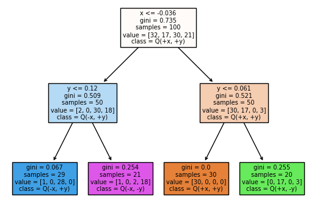

# Pad&#233;
A Python implementation of the Pad&#233; qualitative modeling algorithm published in [1].

## Installing the library

`pip install pade@git+https://github.com/DomenSoberl/pade`

## Using the library

Import `pade.py` and call:

`q_table = pade(data, target, nNeighbours)`

where
- `data` is a 2D *numpy* array containing samples as rows and features as columns.
- `target` is a *numpy* array containing target values for each sample.
- `nNeighbours` - a parameter, typically set between 5 and 10. With higher values, the output is more reliable, but the computation time is longer.

The returned *numpy* array `q_table` contains the signs of partial derivatives for each sample. To translate the returned signs to the Pad&#233; Q-tags (e.g., Q(+x, -y), ...), use:

`q_labels = create_q_labels(q_table, labels)`

where:
- `q_table` is the *signs* table returned by the `pade` function.
- `labels` is an array of feature names (e.g., `['x', 'y']`).

The returned *numpy* array `q_labels` contains the translated Q-tags (e.g., the signs `[+1, -1]` are translated to Q-tag `Q(+x, -y)`).

Finally, to induce a qualitative model, use any preferred classifier. Some classifiers (such as the *scikit-learn* tree classifier) expects the classes to be enumerated as 0, 1, 2, ..., K-1. his can be achieved by calling:

`classes, class_names = enumerate_q_labels(q_labels)`

where:
- `classes` a *numpy* array containing an integer class ID for each sample.
- `class_names` a *numpy* array storing the names of the enumerated classes. This can be used for a quick translation from a class ID to the class name.

## Examples

The script `example_saddle.py` demonstrates learning a qualitative model of the saddle function.

## References

[1] J. Žabkar, M. Možina, I. Bratko, J. Demšar: Learning qualitative models from numerical data, Artificial Intelligence, Volume 175, Issues 9–10, 2011. DOI: 10.1016/j.artint.2011.02.004
